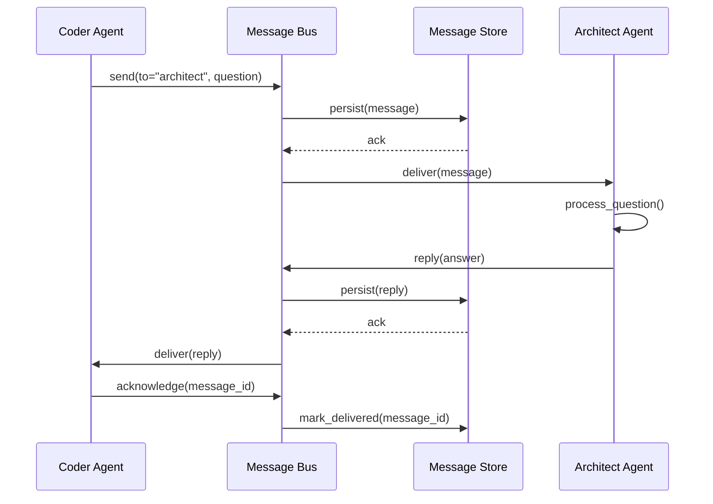
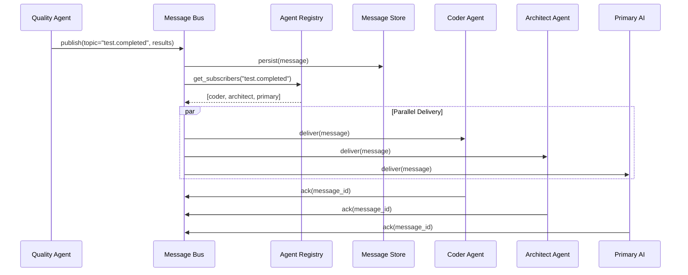
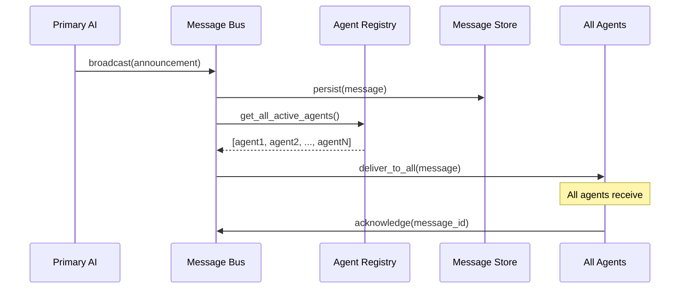
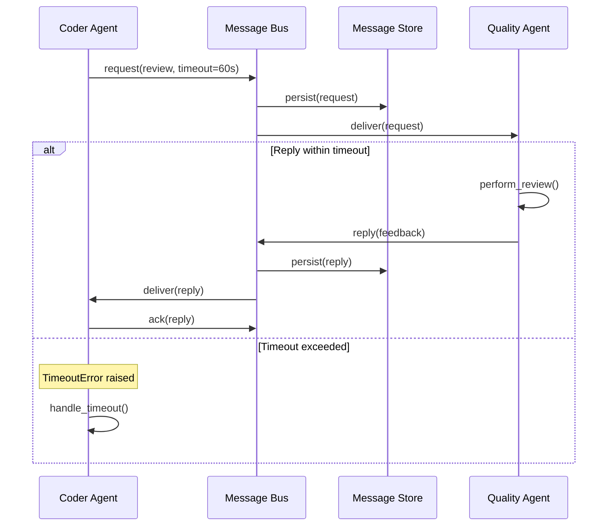
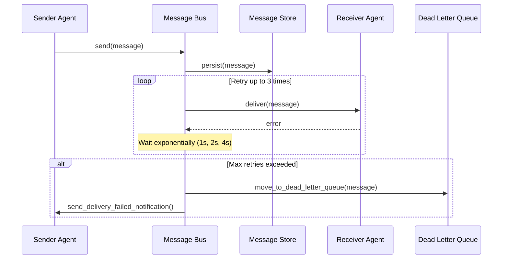
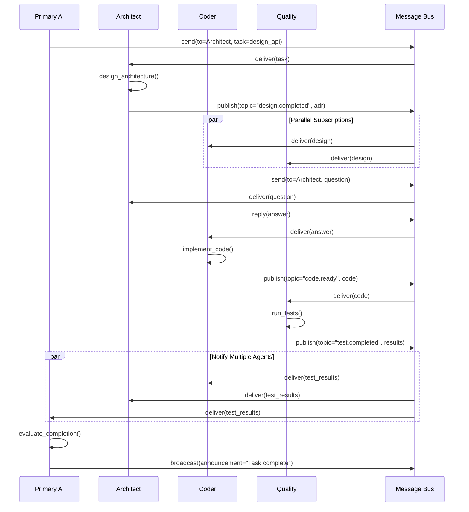

# ADR-004: Agent Communication Protocol Architecture

**Status:** Proposed
**Date:** 2025-10-01
**Decision Makers:** Architecture Team
**Technical Story:** Design comprehensive asynchronous communication protocol for inter-agent messaging to enable scalable AI civilization beyond 10 agents

---

## Executive Summary

As the AI civilization scales beyond its current hierarchical architecture (Primary AI → specialist agents), we face a critical bottleneck: all agent communication flows through the Primary AI coordinator. This creates a single point of failure, limits concurrency, and prevents direct agent-to-agent collaboration.

This ADR proposes a message bus architecture that enables asynchronous, decentralized communication between agents while maintaining coordination, observability, and system coherence. The solution supports multiple routing patterns (pub/sub, direct messaging, broadcast), provides strong message schemas with versioning, and ensures backward compatibility as the system evolves.

**Key Benefits:**
- Eliminates Primary AI bottleneck through asynchronous messaging
- Enables direct agent-to-agent communication
- Scales beyond 10 agents to 100+ agents
- Maintains system coherence through event sourcing
- Supports Phase 4 hybrid multi-tier architecture
- Provides foundation for emergent agent collaboration

---

## Context and Problem Statement

### Current Architecture Limitations

The AI civilization currently operates in a hierarchical model:

```
Primary AI (Coordinator)
    ├── Architect Agent
    ├── Coder Agent
    ├── Researcher Agent
    ├── Quality Agent
    └── ...specialist agents
```

**Critical Problems:**

1. **Primary AI Bottleneck**: All inter-agent communication routes through the Primary AI, creating:
   - Latency: Agents wait for coordinator to relay messages
   - Scalability limits: Coordinator becomes overwhelmed at 10+ agents
   - Single point of failure: System halts if Primary AI is unavailable

2. **No Direct Collaboration**: Agents cannot communicate directly:
   - Coder Agent cannot ask Architect for clarification without coordinator
   - Quality Agent cannot notify Coder of test failures in real-time
   - Researcher cannot share findings with multiple agents simultaneously

3. **Synchronous Blocking**: Current request-response model blocks agent execution:
   - Agent A waits for Agent B's response before continuing
   - No concurrent task execution
   - Poor resource utilization

4. **Limited Observability**: Hard to track complex multi-agent workflows:
   - No audit trail of agent interactions
   - Difficult to debug multi-agent collaboration
   - Cannot reconstruct decision-making process

5. **Inflexible Patterns**: Only supports single request-response pattern:
   - Cannot broadcast announcements (e.g., "deployment complete")
   - Cannot subscribe to events (e.g., "notify me when tests pass")
   - Cannot implement sophisticated coordination patterns

### Requirements

**Functional Requirements:**

1. **Message Bus Architecture**: Central message broker for agent communication
2. **Multiple Routing Patterns**:
   - Direct messaging (Agent A → Agent B)
   - Publish/Subscribe (Agent A → All subscribers of topic X)
   - Broadcast (Agent A → All agents)
   - Request/Reply (Agent A ↔ Agent B with correlation)
3. **Asynchronous Processing**: Non-blocking message send/receive
4. **Message Persistence**: Store messages for reliability and audit
5. **Message Schemas**: Strongly-typed message formats with validation
6. **Message Versioning**: Support schema evolution without breaking changes
7. **Delivery Guarantees**: At-least-once delivery with idempotency support
8. **Dead Letter Queue**: Handle failed message processing
9. **Message Priority**: Support urgent vs. normal message routing
10. **Agent Discovery**: Dynamic agent registration and lookup

**Non-Functional Requirements:**

1. **Performance**: Message latency < 100ms (p95), throughput > 1000 msgs/sec
2. **Scalability**: Support 100+ concurrent agents
3. **Reliability**: 99.9% message delivery success rate
4. **Backward Compatibility**: Support multiple message schema versions
5. **Observability**: Complete message audit trail and metrics
6. **Security**: Message encryption and agent authentication
7. **Extensibility**: Easy to add new message types and patterns
8. **Developer Experience**: Simple API for sending/receiving messages

---

## Decision Drivers

1. **Eliminate Bottleneck**: Must remove Primary AI from critical message path
2. **Scalability**: Support exponential growth to 100+ agents
3. **Asynchronous First**: Enable non-blocking, concurrent agent operations
4. **Flexibility**: Support diverse communication patterns (pub/sub, direct, broadcast)
5. **Reliability**: Messages must not be lost, even during failures
6. **Observability**: Complete visibility into agent interactions
7. **Simplicity**: Easy for new agents to join and communicate
8. **Future-Proof**: Support Phase 4 multi-tier architecture evolution
9. **Python Ecosystem**: Leverage existing Python async libraries
10. **Operational Simplicity**: Minimize infrastructure complexity

---

## Proposed Solution: Message Bus Architecture

### High-Level Architecture

```
┌─────────────────────────────────────────────────────────────────┐
│                      AI Civilization Agents                      │
│  ┌──────────┐  ┌──────────┐  ┌──────────┐  ┌──────────┐       │
│  │ Primary  │  │Architect │  │  Coder   │  │ Quality  │  ...  │
│  │   AI     │  │  Agent   │  │  Agent   │  │  Agent   │       │
│  └────┬─────┘  └────┬─────┘  └────┬─────┘  └────┬─────┘       │
│       │             │              │              │              │
│       └─────────────┴──────────────┴──────────────┘              │
│                             │                                    │
│                    ┌────────▼────────┐                          │
│                    │  Message Bus    │                          │
│                    │    Gateway      │                          │
│                    │  (Agent API)    │                          │
│                    └────────┬────────┘                          │
└─────────────────────────────┼───────────────────────────────────┘
                              │
┌─────────────────────────────▼───────────────────────────────────┐
│                    Message Bus Core                              │
│  ┌──────────────────────────────────────────────────────────┐  │
│  │                    Message Broker                         │  │
│  │  ┌────────────┐  ┌────────────┐  ┌────────────┐         │  │
│  │  │   Direct   │  │  Pub/Sub   │  │ Broadcast  │         │  │
│  │  │  Routing   │  │  Topics    │  │  Channel   │         │  │
│  │  └────────────┘  └────────────┘  └────────────┘         │  │
│  └──────────────────────┬───────────────────────────────────┘  │
│                         │                                       │
│  ┌──────────────────────▼───────────────────────────────────┐  │
│  │              Message Store (Event Log)                    │  │
│  │  - Message persistence                                    │  │
│  │  - Audit trail                                            │  │
│  │  - Event sourcing                                         │  │
│  │  - Dead letter queue                                      │  │
│  └───────────────────────────────────────────────────────────┘  │
│                                                                  │
│  ┌───────────────────────────────────────────────────────────┐  │
│  │              Agent Registry                                │  │
│  │  - Agent registration/deregistration                       │  │
│  │  - Agent capabilities and subscriptions                    │  │
│  │  - Agent health status                                     │  │
│  └───────────────────────────────────────────────────────────┘  │
└──────────────────────────────────────────────────────────────────┘
```

### Core Components

#### 1. Message Bus Gateway (Agent API)

The agent-facing API that provides simple methods for messaging:

```python
from agent_messaging import MessageBus, Message

# Initialize connection
bus = MessageBus.connect(agent_id="coder-agent-001")

# Send direct message
await bus.send(
    to="architect-agent-001",
    message_type="question.clarification",
    payload={"question": "Should I use async or sync storage?"}
)

# Subscribe to topic
await bus.subscribe(
    topic="deployment.completed",
    handler=on_deployment_complete
)

# Publish to topic
await bus.publish(
    topic="build.failed",
    payload={"build_id": "123", "error": "Test failure"}
)

# Broadcast to all agents
await bus.broadcast(
    message_type="system.announcement",
    payload={"message": "System maintenance in 10 minutes"}
)
```

#### 2. Message Broker

Handles routing and delivery of messages:

- **Direct Router**: Routes point-to-point messages by agent ID
- **Topic Manager**: Manages pub/sub subscriptions and message fanout
- **Broadcast Channel**: Delivers messages to all active agents
- **Priority Queue**: Supports urgent and normal priority levels
- **Message Validator**: Validates messages against schemas

#### 3. Message Store (Event Log)

Persistent storage for all messages:

- **Primary Store**: All messages for audit and replay
- **Dead Letter Queue**: Failed messages for investigation
- **Retention Policy**: Configurable message retention (default: 30 days)
- **Query API**: Search messages by time, agent, topic, type

#### 4. Agent Registry

Tracks all active agents and their capabilities:

- **Agent Metadata**: ID, name, type, capabilities, version
- **Subscriptions**: Topics each agent subscribes to
- **Health Status**: Heartbeat monitoring, last seen
- **Discovery**: Find agents by capability or type

---

## Message Payload Schemas

### Base Message Schema

All messages follow this base schema:

```json
{
  "message_id": "msg_01HQXXX...",
  "version": "1.0",
  "timestamp": "2025-10-01T14:30:00.000Z",
  "from": {
    "agent_id": "coder-agent-001",
    "agent_type": "coder",
    "agent_name": "Coder Agent Alpha"
  },
  "to": {
    "agent_id": "architect-agent-001",
    "routing_type": "direct"
  },
  "message_type": "question.clarification",
  "correlation_id": "req_01HQYYY...",
  "reply_to": null,
  "priority": "normal",
  "ttl": 3600,
  "headers": {
    "content_type": "application/json",
    "encoding": "utf-8",
    "encrypted": false
  },
  "payload": {
    "question": "Should I use async or sync storage?",
    "context": {
      "task_id": "task_123",
      "file": "storage.py"
    }
  },
  "metadata": {
    "retry_count": 0,
    "delivery_attempts": [],
    "trace_id": "trace_01HQZZZ..."
  }
}
```

### Schema Fields Explained

**Core Fields:**
- `message_id`: Unique identifier (ULID format for sortability)
- `version`: Message schema version (semantic versioning)
- `timestamp`: ISO 8601 timestamp with milliseconds
- `from`: Sender agent information
- `to`: Recipient information and routing type
- `message_type`: Hierarchical type (category.subcategory.action)
- `correlation_id`: Links related messages (request/reply)
- `reply_to`: For responses, references original message_id
- `priority`: "urgent" or "normal" (affects routing priority)
- `ttl`: Time-to-live in seconds (message expires if undelivered)

**Headers:**
- `content_type`: Payload format (application/json, text/plain)
- `encoding`: Character encoding
- `encrypted`: Whether payload is encrypted

**Metadata:**
- `retry_count`: Number of delivery retries
- `delivery_attempts`: History of delivery attempts
- `trace_id`: Distributed tracing identifier

### Message Type Taxonomy

Message types follow hierarchical naming convention:

**System Messages:**
- `system.heartbeat` - Agent health check
- `system.shutdown` - Agent shutting down
- `system.announcement` - System-wide announcement
- `system.error` - System error notification

**Task Coordination:**
- `task.assigned` - New task assignment
- `task.started` - Agent started working on task
- `task.completed` - Task finished successfully
- `task.failed` - Task failed
- `task.progress` - Progress update

**Agent Collaboration:**
- `question.clarification` - Ask for clarification
- `question.response` - Answer to question
- `review.request` - Request code/design review
- `review.feedback` - Review feedback
- `approval.request` - Request approval
- `approval.granted` - Approval granted
- `approval.denied` - Approval denied

**Build & Deployment:**
- `build.started` - Build process started
- `build.completed` - Build succeeded
- `build.failed` - Build failed
- `deployment.started` - Deployment initiated
- `deployment.completed` - Deployment successful
- `deployment.failed` - Deployment failed

**Data Sharing:**
- `data.findings` - Share research findings
- `data.metrics` - Share performance metrics
- `data.report` - Share report or summary
- `data.artifact` - Share file or artifact

**Event Notifications:**
- `event.file_changed` - File was modified
- `event.test_passed` - Tests passed
- `event.test_failed` - Tests failed
- `event.deployment_ready` - Ready to deploy

### Example Message Payloads

#### 1. Question/Clarification

```json
{
  "message_id": "msg_01HQXXX001",
  "version": "1.0",
  "timestamp": "2025-10-01T14:30:00.000Z",
  "from": {
    "agent_id": "coder-agent-001",
    "agent_type": "coder",
    "agent_name": "Coder Agent Alpha"
  },
  "to": {
    "agent_id": "architect-agent-001",
    "routing_type": "direct"
  },
  "message_type": "question.clarification",
  "correlation_id": "req_01HQYYY001",
  "priority": "normal",
  "ttl": 3600,
  "payload": {
    "question": "Should the user authentication use JWT or session tokens?",
    "context": {
      "task_id": "task_123",
      "task_name": "Implement authentication",
      "file": "auth.py",
      "line": 45,
      "code_snippet": "def authenticate_user(email, password):"
    },
    "options": [
      "JWT with refresh tokens",
      "Session-based with Redis",
      "Both for flexibility"
    ]
  }
}
```

#### 2. Question Response

```json
{
  "message_id": "msg_01HQXXX002",
  "version": "1.0",
  "timestamp": "2025-10-01T14:32:15.000Z",
  "from": {
    "agent_id": "architect-agent-001",
    "agent_type": "architect",
    "agent_name": "Architect Agent Prime"
  },
  "to": {
    "agent_id": "coder-agent-001",
    "routing_type": "direct"
  },
  "message_type": "question.response",
  "correlation_id": "req_01HQYYY001",
  "reply_to": "msg_01HQXXX001",
  "priority": "normal",
  "payload": {
    "answer": "Use JWT with refresh tokens",
    "reasoning": "Aligns with ADR-001 decision for stateless authentication. Provides scalability and works well with the FastAPI stack.",
    "references": [
      "ADR-001: Task Management API Architecture",
      "Section: Authentication: JWT with OAuth 2.0 Flow"
    ],
    "implementation_guidance": {
      "access_token_ttl": "60 minutes",
      "refresh_token_ttl": "7 days",
      "algorithm": "RS256",
      "library": "python-jose"
    }
  }
}
```

#### 3. Pub/Sub Event

```json
{
  "message_id": "msg_01HQXXX003",
  "version": "1.0",
  "timestamp": "2025-10-01T14:35:00.000Z",
  "from": {
    "agent_id": "quality-agent-001",
    "agent_type": "quality",
    "agent_name": "Quality Agent Beta"
  },
  "to": {
    "topic": "test.completed",
    "routing_type": "pubsub"
  },
  "message_type": "event.test_passed",
  "priority": "normal",
  "payload": {
    "test_suite": "integration_tests",
    "tests_run": 45,
    "tests_passed": 45,
    "tests_failed": 0,
    "duration_seconds": 12.3,
    "coverage_percent": 98.5,
    "report_url": "file:///reports/test_2025-10-01_14-35.html",
    "commit_sha": "a1b2c3d4",
    "branch": "feature/authentication"
  }
}
```

#### 4. Broadcast Announcement

```json
{
  "message_id": "msg_01HQXXX004",
  "version": "1.0",
  "timestamp": "2025-10-01T15:00:00.000Z",
  "from": {
    "agent_id": "primary-ai-001",
    "agent_type": "coordinator",
    "agent_name": "Primary AI Coordinator"
  },
  "to": {
    "routing_type": "broadcast"
  },
  "message_type": "system.announcement",
  "priority": "urgent",
  "payload": {
    "announcement": "Emergency deployment hotfix required",
    "severity": "critical",
    "details": "Critical security vulnerability detected in production. All agents should pause non-critical work.",
    "action_required": "Code freeze until hotfix is deployed",
    "expected_duration": "30 minutes",
    "contact": "primary-ai-001"
  }
}
```

#### 5. Task Assignment

```json
{
  "message_id": "msg_01HQXXX005",
  "version": "1.0",
  "timestamp": "2025-10-01T15:05:00.000Z",
  "from": {
    "agent_id": "primary-ai-001",
    "agent_type": "coordinator",
    "agent_name": "Primary AI Coordinator"
  },
  "to": {
    "agent_id": "coder-agent-002",
    "routing_type": "direct"
  },
  "message_type": "task.assigned",
  "correlation_id": "task_456",
  "priority": "urgent",
  "payload": {
    "task_id": "task_456",
    "task_name": "Fix authentication vulnerability",
    "description": "Update JWT validation to prevent token replay attacks",
    "priority": "critical",
    "estimated_effort": "2 hours",
    "due_date": "2025-10-01T17:00:00.000Z",
    "requirements": [
      "Implement nonce checking",
      "Add token expiry validation",
      "Update tests",
      "Deploy to production"
    ],
    "dependencies": [],
    "resources": {
      "architecture_doc": "ADR-001",
      "security_advisory": "https://...",
      "test_cases": "tests/test_auth.py"
    }
  }
}
```

#### 6. Data Sharing (Research Findings)

```json
{
  "message_id": "msg_01HQXXX006",
  "version": "1.0",
  "timestamp": "2025-10-01T16:00:00.000Z",
  "from": {
    "agent_id": "researcher-agent-001",
    "agent_type": "researcher",
    "agent_name": "Researcher Agent Gamma"
  },
  "to": {
    "topic": "research.findings",
    "routing_type": "pubsub"
  },
  "message_type": "data.findings",
  "priority": "normal",
  "payload": {
    "research_topic": "Message Queue Performance Comparison",
    "summary": "Evaluated RabbitMQ, Redis, and in-memory solutions for agent messaging",
    "key_findings": [
      "Redis Streams: 50K msgs/sec, minimal latency, simple deployment",
      "RabbitMQ: 20K msgs/sec, complex routing, requires separate service",
      "In-memory: 200K msgs/sec, no persistence, loses messages on restart"
    ],
    "recommendation": "Redis Streams for optimal balance of performance, reliability, and operational simplicity",
    "confidence": "high",
    "sources": [
      "Redis Streams documentation",
      "RabbitMQ benchmark reports",
      "Internal performance tests"
    ],
    "data": {
      "benchmark_results": "file:///research/mq_benchmark.json",
      "full_report": "file:///research/mq_comparison.md"
    }
  }
}
```

---

## Routing Patterns

### 1. Direct Messaging (Point-to-Point)

**Use Case**: Agent A needs to communicate specifically with Agent B

**Pattern**:
```
Agent A → Message Bus → Agent B
```

**Example**: Coder Agent asks Architect Agent for clarification

**Implementation**:
```python
# Sender (Coder Agent)
response = await bus.send(
    to="architect-agent-001",
    message_type="question.clarification",
    payload={"question": "Which database should I use?"},
    wait_for_reply=True,  # Optional: wait for response
    timeout=30  # seconds
)

# Receiver (Architect Agent)
@bus.on_message("question.clarification")
async def handle_question(message: Message):
    # Process question
    answer = await determine_answer(message.payload["question"])

    # Send reply
    await bus.reply(
        to_message=message,
        payload={"answer": answer}
    )
```

**Routing**: Message routed directly to agent with ID `architect-agent-001`

**Delivery**: At-least-once delivery with acknowledgment

### 2. Publish/Subscribe (Topic-Based)

**Use Case**: Agent wants to notify multiple interested agents about an event

**Pattern**:
```
Agent A → Topic → Subscribed Agents (B, C, D)
```

**Example**: Quality Agent publishes test results; Coder, Architect, and Primary AI all subscribe

**Implementation**:
```python
# Publisher (Quality Agent)
await bus.publish(
    topic="test.completed",
    message_type="event.test_passed",
    payload={
        "test_suite": "integration_tests",
        "tests_passed": 45,
        "coverage": 98.5
    }
)

# Subscribers (Multiple Agents)
# Coder Agent
@bus.subscribe("test.completed")
async def on_test_complete(message: Message):
    if message.payload["tests_passed"] < message.payload["tests_run"]:
        await investigate_failures(message)

# Architect Agent
@bus.subscribe("test.completed")
async def on_test_complete(message: Message):
    await update_quality_metrics(message)

# Primary AI
@bus.subscribe("test.completed")
async def on_test_complete(message: Message):
    await log_test_results(message)
```

**Routing**: Message delivered to all agents subscribed to `test.completed` topic

**Topics Hierarchy**:
- Topics can be hierarchical: `test.*` subscribes to all test events
- `test.passed` - only passed tests
- `test.failed` - only failed tests
- `test.completed` - all completed tests

### 3. Broadcast (All Agents)

**Use Case**: System-wide announcement or emergency notification

**Pattern**:
```
Agent A → All Active Agents
```

**Example**: Primary AI announces system maintenance

**Implementation**:
```python
# Broadcaster (Primary AI)
await bus.broadcast(
    message_type="system.announcement",
    payload={
        "announcement": "System maintenance in 10 minutes",
        "severity": "warning",
        "expected_duration": "30 minutes"
    },
    priority="urgent"
)

# All agents receive
@bus.on_message("system.announcement")
async def on_announcement(message: Message):
    await log_announcement(message)
    if message.payload["severity"] == "critical":
        await pause_non_critical_work()
```

**Routing**: Message delivered to all agents currently connected to message bus

**Use Cases**: System announcements, emergency shutdowns, global configuration changes

### 4. Request/Reply Pattern

**Use Case**: Synchronous-style request-response communication

**Pattern**:
```
Agent A → Request → Agent B
Agent B → Reply → Agent A
```

**Example**: Coder Agent requests code review from Quality Agent

**Implementation**:
```python
# Requester (Coder Agent)
try:
    reply = await bus.request(
        to="quality-agent-001",
        message_type="review.request",
        payload={
            "code_file": "auth.py",
            "changes": "Added JWT authentication",
            "diff_url": "file:///diffs/auth.diff"
        },
        timeout=60  # Wait up to 60 seconds for reply
    )

    if reply.payload["approved"]:
        await commit_changes()
    else:
        await address_feedback(reply.payload["feedback"])

except TimeoutError:
    # No reply received
    await log_error("Review request timed out")
    await notify_primary_ai()

# Responder (Quality Agent)
@bus.on_request("review.request")
async def handle_review_request(message: Message):
    # Perform review
    review_result = await review_code(message.payload["code_file"])

    # Return reply (automatically correlates with request)
    return {
        "approved": review_result.passed,
        "feedback": review_result.comments,
        "severity": review_result.severity
    }
```

**Correlation**: Request and reply linked via `correlation_id` and `reply_to` fields

**Timeout Handling**: Requester can specify timeout; raises TimeoutError if no reply

---

## Message Flow Diagrams

### Diagram 1: Direct Messaging Flow



### Diagram 2: Pub/Sub Pattern



### Diagram 3: Broadcast Flow



### Diagram 4: Request/Reply with Timeout



### Diagram 5: Failed Message Handling



### Diagram 6: Multi-Agent Collaboration Workflow



---

## Implementation Guidelines for Coder Agent

### Technology Stack Recommendation

**Message Broker: Redis Streams**

**Rationale:**
- **Performance**: 50K+ messages/sec throughput
- **Persistence**: Messages stored in Redis with configurable retention
- **Consumer Groups**: Built-in support for pub/sub and competing consumers
- **Simplicity**: Single Redis instance, no complex clustering needed
- **Python Support**: Excellent async support via `redis-py` and `aioredis`
- **Operational**: Already familiar in Python ecosystem, easy monitoring
- **Scalability**: Can handle 100+ agents easily

**Alternatives Considered:**
- **RabbitMQ**: More complex, requires separate service, slower performance
- **Kafka**: Overkill for this use case, complex operational overhead
- **In-Memory (asyncio.Queue)**: No persistence, loses messages on restart

**Decision**: Use Redis Streams for optimal balance of performance, reliability, and simplicity.

### Core Implementation Architecture

**File Structure:**
```
agent_messaging/
├── __init__.py
├── bus.py                 # Main MessageBus class
├── message.py             # Message schemas and validation
├── broker/
│   ├── __init__.py
│   ├── redis_broker.py    # Redis Streams implementation
│   └── base.py            # Abstract broker interface
├── routing/
│   ├── __init__.py
│   ├── direct.py          # Direct message routing
│   ├── pubsub.py          # Pub/sub routing
│   └── broadcast.py       # Broadcast routing
├── registry.py            # Agent registry
├── store.py               # Message persistence
├── serialization.py       # Message serialization/deserialization
├── exceptions.py          # Custom exceptions
└── monitoring.py          # Metrics and observability
```

### Message Schema Implementation

**File: `agent_messaging/message.py`**

```python
"""Message schemas and validation using Pydantic."""

from typing import Optional, Dict, Any, List, Literal
from datetime import datetime
from pydantic import BaseModel, Field, validator
from ulid import ULID


class AgentInfo(BaseModel):
    """Agent identification information."""
    agent_id: str = Field(..., description="Unique agent identifier")
    agent_type: str = Field(..., description="Agent type (coder, architect, etc.)")
    agent_name: str = Field(..., description="Human-readable agent name")


class RoutingInfo(BaseModel):
    """Message routing information."""
    agent_id: Optional[str] = Field(None, description="Direct recipient agent ID")
    topic: Optional[str] = Field(None, description="Pub/sub topic")
    routing_type: Literal["direct", "pubsub", "broadcast"] = Field(
        ..., description="Message routing type"
    )

    @validator('routing_type')
    def validate_routing(cls, v, values):
        """Validate routing configuration."""
        if v == "direct" and not values.get("agent_id"):
            raise ValueError("Direct routing requires agent_id")
        if v == "pubsub" and not values.get("topic"):
            raise ValueError("Pub/sub routing requires topic")
        return v


class MessageHeaders(BaseModel):
    """Message headers."""
    content_type: str = "application/json"
    encoding: str = "utf-8"
    encrypted: bool = False


class MessageMetadata(BaseModel):
    """Message metadata."""
    retry_count: int = 0
    delivery_attempts: List[Dict[str, Any]] = Field(default_factory=list)
    trace_id: str = Field(default_factory=lambda: str(ULID()))


class Message(BaseModel):
    """Base message schema."""

    message_id: str = Field(default_factory=lambda: f"msg_{ULID()}")
    version: str = "1.0"
    timestamp: datetime = Field(default_factory=datetime.utcnow)

    from_agent: AgentInfo = Field(..., alias="from")
    to: RoutingInfo

    message_type: str = Field(..., description="Hierarchical message type")
    correlation_id: Optional[str] = Field(None, description="Request correlation ID")
    reply_to: Optional[str] = Field(None, description="Original message ID for replies")

    priority: Literal["normal", "urgent"] = "normal"
    ttl: int = Field(3600, description="Time-to-live in seconds")

    headers: MessageHeaders = Field(default_factory=MessageHeaders)
    payload: Dict[str, Any] = Field(..., description="Message payload")
    metadata: MessageMetadata = Field(default_factory=MessageMetadata)

    class Config:
        populate_by_name = True
        json_encoders = {
            datetime: lambda v: v.isoformat()
        }

    @validator('message_type')
    def validate_message_type(cls, v):
        """Validate message type format."""
        parts = v.split('.')
        if len(parts) < 2:
            raise ValueError("Message type must be hierarchical (e.g., 'task.assigned')")
        return v

    def is_expired(self) -> bool:
        """Check if message has exceeded TTL."""
        age = (datetime.utcnow() - self.timestamp).total_seconds()
        return age > self.ttl

    def to_dict(self) -> Dict[str, Any]:
        """Serialize to dictionary."""
        return self.dict(by_alias=True)

    @classmethod
    def from_dict(cls, data: Dict[str, Any]) -> "Message":
        """Deserialize from dictionary."""
        return cls(**data)
```

### MessageBus Core API

**File: `agent_messaging/bus.py`**

```python
"""Main MessageBus API for agent communication."""

import asyncio
import logging
from typing import Optional, Callable, Dict, Any, List
from contextlib import asynccontextmanager

from .message import Message, AgentInfo, RoutingInfo
from .broker.redis_broker import RedisBroker
from .registry import AgentRegistry
from .store import MessageStore
from .exceptions import MessageTimeoutError, DeliveryError


logger = logging.getLogger(__name__)


class MessageBus:
    """Main message bus API for agents."""

    def __init__(
        self,
        agent_id: str,
        agent_type: str,
        agent_name: str,
        redis_url: str = "redis://localhost:6379/0"
    ):
        self.agent_info = AgentInfo(
            agent_id=agent_id,
            agent_type=agent_type,
            agent_name=agent_name
        )

        self.broker = RedisBroker(redis_url)
        self.registry = AgentRegistry(redis_url)
        self.store = MessageStore(redis_url)

        self._handlers: Dict[str, List[Callable]] = {}
        self._subscriptions: set[str] = set()
        self._running = False
        self._consumer_task: Optional[asyncio.Task] = None

    async def connect(self):
        """Connect to message bus."""
        await self.broker.connect()
        await self.registry.register_agent(self.agent_info)
        logger.info(f"Agent {self.agent_info.agent_id} connected to message bus")

    async def disconnect(self):
        """Disconnect from message bus."""
        self._running = False
        if self._consumer_task:
            self._consumer_task.cancel()
        await self.registry.deregister_agent(self.agent_info.agent_id)
        await self.broker.disconnect()
        logger.info(f"Agent {self.agent_info.agent_id} disconnected from message bus")

    async def send(
        self,
        to: str,
        message_type: str,
        payload: Dict[str, Any],
        priority: str = "normal",
        correlation_id: Optional[str] = None,
        wait_for_reply: bool = False,
        timeout: int = 30
    ) -> Optional[Message]:
        """
        Send a direct message to another agent.

        Args:
            to: Target agent ID
            message_type: Message type (e.g., "question.clarification")
            payload: Message payload
            priority: "normal" or "urgent"
            correlation_id: Optional correlation ID for tracking
            wait_for_reply: If True, wait for reply message
            timeout: Timeout in seconds if wait_for_reply=True

        Returns:
            Reply message if wait_for_reply=True, else None
        """
        message = Message(
            from_agent=self.agent_info,
            to=RoutingInfo(agent_id=to, routing_type="direct"),
            message_type=message_type,
            payload=payload,
            priority=priority,
            correlation_id=correlation_id
        )

        # Persist message
        await self.store.save_message(message)

        # Send via broker
        await self.broker.send_direct(message)

        logger.info(f"Sent {message_type} to {to}: {message.message_id}")

        # Wait for reply if requested
        if wait_for_reply:
            return await self._wait_for_reply(message.message_id, timeout)

        return None

    async def publish(
        self,
        topic: str,
        message_type: str,
        payload: Dict[str, Any],
        priority: str = "normal"
    ):
        """
        Publish a message to a topic (pub/sub).

        Args:
            topic: Topic name (e.g., "test.completed")
            message_type: Message type
            payload: Message payload
            priority: "normal" or "urgent"
        """
        message = Message(
            from_agent=self.agent_info,
            to=RoutingInfo(topic=topic, routing_type="pubsub"),
            message_type=message_type,
            payload=payload,
            priority=priority
        )

        await self.store.save_message(message)
        await self.broker.publish(message)

        logger.info(f"Published {message_type} to topic {topic}: {message.message_id}")

    async def broadcast(
        self,
        message_type: str,
        payload: Dict[str, Any],
        priority: str = "normal"
    ):
        """
        Broadcast a message to all agents.

        Args:
            message_type: Message type (e.g., "system.announcement")
            payload: Message payload
            priority: "normal" or "urgent"
        """
        message = Message(
            from_agent=self.agent_info,
            to=RoutingInfo(routing_type="broadcast"),
            message_type=message_type,
            payload=payload,
            priority=priority
        )

        await self.store.save_message(message)
        await self.broker.broadcast(message)

        logger.info(f"Broadcast {message_type}: {message.message_id}")

    async def reply(
        self,
        to_message: Message,
        payload: Dict[str, Any],
        message_type: Optional[str] = None
    ):
        """
        Reply to a message.

        Args:
            to_message: Original message to reply to
            payload: Reply payload
            message_type: Optional custom message type (defaults to original + ".response")
        """
        reply_type = message_type or f"{to_message.message_type}.response"

        reply = Message(
            from_agent=self.agent_info,
            to=RoutingInfo(
                agent_id=to_message.from_agent.agent_id,
                routing_type="direct"
            ),
            message_type=reply_type,
            payload=payload,
            correlation_id=to_message.correlation_id,
            reply_to=to_message.message_id
        )

        await self.store.save_message(reply)
        await self.broker.send_direct(reply)

        logger.info(f"Sent reply to {to_message.message_id}: {reply.message_id}")

    async def request(
        self,
        to: str,
        message_type: str,
        payload: Dict[str, Any],
        timeout: int = 60
    ) -> Message:
        """
        Send a request and wait for reply (synchronous-style).

        Args:
            to: Target agent ID
            message_type: Message type
            payload: Request payload
            timeout: Timeout in seconds

        Returns:
            Reply message

        Raises:
            MessageTimeoutError: If no reply received within timeout
        """
        reply = await self.send(
            to=to,
            message_type=message_type,
            payload=payload,
            wait_for_reply=True,
            timeout=timeout
        )

        if not reply:
            raise MessageTimeoutError(f"No reply received within {timeout}s")

        return reply

    def subscribe(self, topic: str):
        """
        Subscribe to a topic.

        Decorator usage:
            @bus.subscribe("test.completed")
            async def on_test_complete(message: Message):
                ...
        """
        def decorator(handler: Callable):
            self.on_message(topic, handler)
            self._subscriptions.add(topic)
            return handler
        return decorator

    def on_message(self, message_type: str, handler: Optional[Callable] = None):
        """
        Register a message handler.

        Can be used as decorator or direct call:
            @bus.on_message("task.assigned")
            async def handle_task(msg): ...

            OR

            bus.on_message("task.assigned", handle_task)
        """
        def register_handler(func: Callable):
            if message_type not in self._handlers:
                self._handlers[message_type] = []
            self._handlers[message_type].append(func)
            logger.info(f"Registered handler for {message_type}")
            return func

        if handler:
            return register_handler(handler)
        return register_handler

    async def start_consuming(self):
        """Start consuming messages."""
        self._running = True

        # Subscribe to all registered topics
        for topic in self._subscriptions:
            await self.broker.subscribe_topic(self.agent_info.agent_id, topic)

        # Subscribe to direct messages for this agent
        await self.broker.subscribe_direct(self.agent_info.agent_id)

        # Start consumer loop
        self._consumer_task = asyncio.create_task(self._consume_loop())
        logger.info(f"Started consuming messages for {self.agent_info.agent_id}")

    async def _consume_loop(self):
        """Main message consumption loop."""
        while self._running:
            try:
                # Poll for messages
                messages = await self.broker.consume_messages(
                    self.agent_info.agent_id,
                    count=10,
                    block_ms=1000
                )

                # Process each message
                for message in messages:
                    await self._process_message(message)

            except asyncio.CancelledError:
                break
            except Exception as e:
                logger.error(f"Error in consume loop: {e}", exc_info=True)
                await asyncio.sleep(1)

    async def _process_message(self, message: Message):
        """Process a received message."""
        try:
            # Check if expired
            if message.is_expired():
                logger.warning(f"Discarding expired message: {message.message_id}")
                return

            # Find handlers
            handlers = self._handlers.get(message.message_type, [])

            # Also check wildcard handlers (e.g., "test.*")
            type_parts = message.message_type.split('.')
            for i in range(len(type_parts)):
                wildcard = '.'.join(type_parts[:i+1]) + '.*'
                handlers.extend(self._handlers.get(wildcard, []))

            if not handlers:
                logger.debug(f"No handler for {message.message_type}")
                return

            # Execute handlers
            for handler in handlers:
                try:
                    await handler(message)
                except Exception as e:
                    logger.error(
                        f"Handler error for {message.message_type}: {e}",
                        exc_info=True
                    )

            # Acknowledge message
            await self.broker.acknowledge_message(message.message_id)

        except Exception as e:
            logger.error(f"Error processing message {message.message_id}: {e}")

    async def _wait_for_reply(
        self,
        original_message_id: str,
        timeout: int
    ) -> Optional[Message]:
        """Wait for a reply to a specific message."""
        reply_future = asyncio.Future()

        async def reply_handler(message: Message):
            if message.reply_to == original_message_id:
                if not reply_future.done():
                    reply_future.set_result(message)

        # Register temporary handler for any message type
        self.on_message("*", reply_handler)

        try:
            reply = await asyncio.wait_for(reply_future, timeout=timeout)
            return reply
        except asyncio.TimeoutError:
            logger.warning(f"Reply timeout for message {original_message_id}")
            return None

    @classmethod
    @asynccontextmanager
    async def connect_agent(
        cls,
        agent_id: str,
        agent_type: str,
        agent_name: str,
        redis_url: str = "redis://localhost:6379/0"
    ):
        """
        Context manager for automatic connect/disconnect.

        Usage:
            async with MessageBus.connect_agent("coder-001", "coder", "Coder") as bus:
                await bus.send(...)
        """
        bus = cls(agent_id, agent_type, agent_name, redis_url)
        await bus.connect()
        try:
            yield bus
        finally:
            await bus.disconnect()
```

### Usage Examples

**Example 1: Simple Direct Messaging**

```python
from agent_messaging import MessageBus

async def main():
    # Connect to message bus
    async with MessageBus.connect_agent(
        agent_id="coder-agent-001",
        agent_type="coder",
        agent_name="Coder Agent Alpha"
    ) as bus:

        # Send question to architect
        await bus.send(
            to="architect-agent-001",
            message_type="question.clarification",
            payload={
                "question": "Should I use async or sync storage?",
                "context": {"file": "storage.py", "line": 45}
            }
        )
```

**Example 2: Request/Reply Pattern**

```python
async def ask_architect_and_wait():
    async with MessageBus.connect_agent(
        agent_id="coder-agent-001",
        agent_type="coder",
        agent_name="Coder Agent Alpha"
    ) as bus:

        # Send request and wait for reply
        reply = await bus.request(
            to="architect-agent-001",
            message_type="question.clarification",
            payload={"question": "Which database to use?"},
            timeout=30
        )

        print(f"Architect replied: {reply.payload['answer']}")
```

**Example 3: Pub/Sub Pattern**

```python
async def quality_agent_main():
    async with MessageBus.connect_agent(
        agent_id="quality-agent-001",
        agent_type="quality",
        agent_name="Quality Agent"
    ) as bus:

        # Publish test results
        await bus.publish(
            topic="test.completed",
            message_type="event.test_passed",
            payload={
                "test_suite": "integration",
                "tests_passed": 45,
                "coverage": 98.5
            }
        )

async def coder_agent_main():
    async with MessageBus.connect_agent(
        agent_id="coder-agent-001",
        agent_type="coder",
        agent_name="Coder Agent"
    ) as bus:

        # Subscribe to test results
        @bus.subscribe("test.completed")
        async def on_test_complete(message):
            print(f"Tests completed: {message.payload}")
            if message.payload["tests_passed"] < message.payload.get("tests_run", 0):
                await investigate_failures(message)

        # Start consuming messages
        await bus.start_consuming()

        # Keep running
        await asyncio.sleep(3600)
```

**Example 4: Message Handlers**

```python
async def agent_with_handlers():
    bus = MessageBus(
        agent_id="coder-agent-001",
        agent_type="coder",
        agent_name="Coder Agent"
    )
    await bus.connect()

    # Register handler for task assignments
    @bus.on_message("task.assigned")
    async def handle_task(message):
        task = message.payload
        print(f"Received task: {task['task_name']}")
        await implement_task(task)

        # Notify completion
        await bus.publish(
            topic="task.completed",
            message_type="task.completed",
            payload={"task_id": task["task_id"]}
        )

    # Register handler for questions
    @bus.on_message("question.*")
    async def handle_question(message):
        print(f"Question received: {message.payload['question']}")
        answer = await determine_answer(message.payload)
        await bus.reply(message, payload={"answer": answer})

    # Register handler for system announcements
    @bus.on_message("system.announcement")
    async def handle_announcement(message):
        print(f"ANNOUNCEMENT: {message.payload['announcement']}")
        if message.payload["severity"] == "critical":
            await pause_work()

    # Start consuming
    await bus.start_consuming()

    # Keep running
    try:
        await asyncio.sleep(float('inf'))
    finally:
        await bus.disconnect()
```

---

## Message Versioning Strategy

### Version Format

Messages use **semantic versioning**: `MAJOR.MINOR` (e.g., `1.0`, `2.1`)

- **MAJOR**: Breaking changes (incompatible schema changes)
- **MINOR**: Backward-compatible additions (new optional fields)

### Versioning Rules

**Breaking Changes (MAJOR bump):**
- Removing a required field
- Changing field type (e.g., string → int)
- Renaming a field
- Changing field semantics

**Non-Breaking Changes (MINOR bump):**
- Adding optional fields
- Adding new enum values
- Deprecating fields (but not removing)
- Adding validation relaxations

### Version Compatibility

Agents must support **N and N-1 major versions** simultaneously during transition periods:

```python
class MessageV1(BaseModel):
    """Message schema version 1.0."""
    version: str = "1.0"
    payload: Dict[str, Any]

class MessageV2(BaseModel):
    """Message schema version 2.0."""
    version: str = "2.0"
    payload: Dict[str, Any]
    extended_metadata: Optional[Dict[str, Any]] = None  # New in v2

def parse_message(data: Dict) -> Union[MessageV1, MessageV2]:
    """Parse message based on version."""
    version = data.get("version", "1.0")

    if version.startswith("1."):
        return MessageV1(**data)
    elif version.startswith("2."):
        return MessageV2(**data)
    else:
        raise ValueError(f"Unsupported message version: {version}")
```

### Migration Strategy

**Phase 1: Deprecation Announcement (30 days)**
- Announce upcoming breaking change
- Provide migration guide
- Log warnings when old version used

**Phase 2: Dual Support (60 days)**
- Support both old and new versions
- New messages use new version
- Accept messages in both versions
- Convert old → new internally

**Phase 3: Migration Complete**
- Drop support for old version
- All agents upgraded
- Remove conversion code

**Example Migration:**

```python
# Version 1.0 - Original schema
{
  "version": "1.0",
  "from": "coder-agent-001",  # Simple string
  "to": "architect-agent-001",
  "message_type": "question",
  "payload": {...}
}

# Version 2.0 - Enhanced schema
{
  "version": "2.0",
  "from": {                    # Now structured object
    "agent_id": "coder-agent-001",
    "agent_type": "coder",
    "agent_name": "Coder Agent"
  },
  "to": {
    "agent_id": "architect-agent-001",
    "routing_type": "direct"
  },
  "message_type": "question.clarification",  # More specific
  "payload": {...}
}

# Conversion function during dual support
def convert_v1_to_v2(v1_msg: dict) -> dict:
    """Convert v1 message to v2 format."""
    return {
        "version": "2.0",
        "from": {
            "agent_id": v1_msg["from"],
            "agent_type": "unknown",  # Best effort
            "agent_name": v1_msg["from"]
        },
        "to": {
            "agent_id": v1_msg["to"],
            "routing_type": "direct"
        },
        "message_type": v1_msg["message_type"],
        "payload": v1_msg["payload"]
    }
```

---

## Backward Compatibility Design

### Compatibility Guarantees

1. **Field Addition**: Can add optional fields without breaking consumers
2. **Field Deprecation**: Mark fields as deprecated for 2 minor versions before removal
3. **Type Widening**: Can make validation less strict (e.g., accept more values)
4. **Default Values**: All new required fields must have sensible defaults

### Compatibility Patterns

**Pattern 1: Optional Fields with Defaults**

```python
# v1.0
class TaskMessage(BaseModel):
    task_id: str
    task_name: str

# v1.1 - Add optional priority
class TaskMessage(BaseModel):
    task_id: str
    task_name: str
    priority: str = "normal"  # Default for backward compatibility
```

**Pattern 2: Field Deprecation**

```python
# v2.0 - Deprecate old field, add new
class Message(BaseModel):
    # Old field (deprecated but still accepted)
    timestamp_unix: Optional[int] = Field(
        None,
        deprecated=True,
        description="DEPRECATED: Use timestamp instead"
    )

    # New field (preferred)
    timestamp: datetime = Field(default_factory=datetime.utcnow)

    @validator('timestamp', pre=True, always=True)
    def convert_timestamp(cls, v, values):
        """Convert old format to new if needed."""
        if v is None and values.get('timestamp_unix'):
            return datetime.fromtimestamp(values['timestamp_unix'])
        return v or datetime.utcnow()
```

**Pattern 3: Envelope Pattern for Unknown Fields**

```python
class Message(BaseModel):
    # Known fields
    message_id: str
    version: str
    payload: Dict[str, Any]

    # Accept unknown fields for forward compatibility
    class Config:
        extra = "allow"  # Accept but ignore unknown fields
```

### Version Detection and Routing

```python
class MessageRouter:
    """Route messages based on version compatibility."""

    async def route_message(self, message: dict):
        """Route message to appropriate handler based on version."""
        version = message.get("version", "1.0")
        major_version = int(version.split('.')[0])

        # Route to version-specific handler
        if major_version == 1:
            return await self.handle_v1(message)
        elif major_version == 2:
            return await self.handle_v2(message)
        else:
            raise UnsupportedVersionError(
                f"Message version {version} not supported. "
                f"Supported versions: 1.x, 2.x"
            )
```

---

## Security Considerations

### Authentication and Authorization

**Agent Authentication:**
- Each agent has unique ID and secret key
- Messages signed with agent's secret key (HMAC-SHA256)
- Message bus verifies signature before routing

```python
import hmac
import hashlib

class SecureMessage(Message):
    """Message with signature verification."""
    signature: str = Field(..., description="HMAC signature")

    @classmethod
    def create_signed(
        cls,
        agent_secret: str,
        **kwargs
    ) -> "SecureMessage":
        """Create message with signature."""
        msg = cls(**kwargs)
        msg_bytes = msg.json(exclude={"signature"}).encode()
        signature = hmac.new(
            agent_secret.encode(),
            msg_bytes,
            hashlib.sha256
        ).hexdigest()
        msg.signature = signature
        return msg

    def verify_signature(self, agent_secret: str) -> bool:
        """Verify message signature."""
        msg_bytes = self.json(exclude={"signature"}).encode()
        expected = hmac.new(
            agent_secret.encode(),
            msg_bytes,
            hashlib.sha256
        ).hexdigest()
        return hmac.compare_digest(self.signature, expected)
```

**Authorization Rules:**
- Agents can only send messages as themselves (enforce `from` field)
- Topic subscriptions require permission grants
- Broadcast limited to coordinator agents
- Message store access restricted by agent ID

### Message Encryption

**Sensitive Payload Encryption:**

```python
from cryptography.fernet import Fernet

class EncryptedMessage(Message):
    """Message with encrypted payload."""

    @classmethod
    def create_encrypted(
        cls,
        encryption_key: bytes,
        payload: Dict[str, Any],
        **kwargs
    ) -> "EncryptedMessage":
        """Create message with encrypted payload."""
        fernet = Fernet(encryption_key)
        payload_json = json.dumps(payload)
        encrypted = fernet.encrypt(payload_json.encode())

        msg = cls(
            payload={"encrypted": encrypted.decode()},
            headers=MessageHeaders(encrypted=True),
            **kwargs
        )
        return msg

    def decrypt_payload(self, encryption_key: bytes) -> Dict[str, Any]:
        """Decrypt payload."""
        if not self.headers.encrypted:
            return self.payload

        fernet = Fernet(encryption_key)
        encrypted = self.payload["encrypted"].encode()
        decrypted = fernet.decrypt(encrypted)
        return json.loads(decrypted)
```

### Rate Limiting

**Per-Agent Rate Limits:**
- Normal priority: 100 messages/second
- Urgent priority: 10 messages/second
- Broadcast: 1 message/minute

```python
class RateLimiter:
    """Token bucket rate limiter."""

    def __init__(self, rate: int, burst: int):
        self.rate = rate  # tokens per second
        self.burst = burst  # max tokens
        self.tokens = burst
        self.last_update = time.time()

    async def acquire(self) -> bool:
        """Acquire a token if available."""
        now = time.time()
        elapsed = now - self.last_update

        # Add tokens based on elapsed time
        self.tokens = min(
            self.burst,
            self.tokens + elapsed * self.rate
        )
        self.last_update = now

        # Check if token available
        if self.tokens >= 1:
            self.tokens -= 1
            return True
        return False

# Usage
agent_limiter = RateLimiter(rate=100, burst=200)

async def send_with_rate_limit(message):
    if await agent_limiter.acquire():
        await bus.send(message)
    else:
        raise RateLimitExceeded("Agent rate limit exceeded")
```

### Audit Logging

All messages logged for security audit:

```python
class AuditLogger:
    """Log all message activity for security audit."""

    async def log_message(self, message: Message, action: str):
        """Log message activity."""
        await self.log_store.insert({
            "timestamp": datetime.utcnow(),
            "action": action,  # "sent", "received", "failed"
            "message_id": message.message_id,
            "from_agent": message.from_agent.agent_id,
            "to": message.to.dict(),
            "message_type": message.message_type,
            "priority": message.priority,
            "trace_id": message.metadata.trace_id
        })
```

---

## Performance Optimization Strategies

### 1. Message Batching

Batch multiple messages for efficient network utilization:

```python
class BatchedMessageBus(MessageBus):
    """Message bus with automatic batching."""

    def __init__(self, *args, batch_size=10, batch_timeout=0.1, **kwargs):
        super().__init__(*args, **kwargs)
        self.batch_size = batch_size
        self.batch_timeout = batch_timeout
        self._batch_queue = []
        self._batch_task = None

    async def send(self, **kwargs):
        """Add message to batch."""
        message = self._create_message(**kwargs)
        self._batch_queue.append(message)

        # Flush if batch full
        if len(self._batch_queue) >= self.batch_size:
            await self._flush_batch()

        # Start timeout timer
        if not self._batch_task:
            self._batch_task = asyncio.create_task(
                self._batch_timeout_handler()
            )

    async def _flush_batch(self):
        """Send all batched messages."""
        if not self._batch_queue:
            return

        messages = self._batch_queue[:]
        self._batch_queue.clear()

        # Send as batch to broker
        await self.broker.send_batch(messages)

        # Cancel timeout
        if self._batch_task:
            self._batch_task.cancel()
            self._batch_task = None

    async def _batch_timeout_handler(self):
        """Flush batch after timeout."""
        await asyncio.sleep(self.batch_timeout)
        await self._flush_batch()
```

### 2. Message Compression

Compress large payloads:

```python
import zlib
import base64

class CompressedMessage(Message):
    """Message with compressed payload."""

    @classmethod
    def create_compressed(cls, payload: Dict, threshold_bytes=1024, **kwargs):
        """Compress payload if large enough."""
        payload_json = json.dumps(payload)

        if len(payload_json) > threshold_bytes:
            compressed = zlib.compress(payload_json.encode())
            encoded = base64.b64encode(compressed).decode()

            return cls(
                payload={"compressed": encoded},
                headers=MessageHeaders(
                    content_type="application/json+compressed",
                    encoding="base64"
                ),
                **kwargs
            )
        else:
            return cls(payload=payload, **kwargs)

    def decompress_payload(self) -> Dict:
        """Decompress payload if compressed."""
        if self.headers.content_type == "application/json+compressed":
            encoded = self.payload["compressed"]
            compressed = base64.b64decode(encoded)
            decompressed = zlib.decompress(compressed)
            return json.loads(decompressed)
        return self.payload
```

### 3. Connection Pooling

Reuse Redis connections:

```python
from redis.asyncio import ConnectionPool

class OptimizedRedisBroker:
    """Redis broker with connection pooling."""

    def __init__(self, redis_url: str, pool_size=20):
        self.pool = ConnectionPool.from_url(
            redis_url,
            max_connections=pool_size,
            decode_responses=True
        )
        self.redis = None

    async def connect(self):
        """Create Redis client from pool."""
        self.redis = redis.Redis(connection_pool=self.pool)
```

### 4. Message Prioritization

Use priority queues for urgent messages:

```python
# Redis Streams with priority
async def send_with_priority(message: Message):
    """Send message to appropriate priority stream."""
    stream_name = f"messages:{message.priority}"  # messages:urgent or messages:normal

    await redis.xadd(
        stream_name,
        {"message": message.json()},
        maxlen=10000  # Keep last 10K messages
    )

async def consume_with_priority():
    """Consume urgent messages first."""
    # Try urgent stream first
    urgent = await redis.xread(
        {"messages:urgent": "$"},
        count=10,
        block=100
    )

    if urgent:
        return urgent

    # Fall back to normal priority
    normal = await redis.xread(
        {"messages:normal": "$"},
        count=10,
        block=1000
    )
    return normal
```

### 5. Caching and Indexing

Cache frequently accessed data:

```python
from functools import lru_cache

class CachedAgentRegistry:
    """Agent registry with caching."""

    def __init__(self, redis_url: str, cache_ttl=60):
        self.redis_url = redis_url
        self.cache_ttl = cache_ttl
        self._cache = {}
        self._cache_timestamps = {}

    async def get_agent(self, agent_id: str) -> Optional[AgentInfo]:
        """Get agent info with caching."""
        # Check cache
        if agent_id in self._cache:
            cached_time = self._cache_timestamps[agent_id]
            if time.time() - cached_time < self.cache_ttl:
                return self._cache[agent_id]

        # Fetch from Redis
        agent_data = await self.redis.hget("agents", agent_id)
        if agent_data:
            agent = AgentInfo(**json.loads(agent_data))

            # Update cache
            self._cache[agent_id] = agent
            self._cache_timestamps[agent_id] = time.time()

            return agent

        return None
```

### Performance Targets

**Target Metrics:**
- Message send latency: p50 < 10ms, p95 < 50ms, p99 < 100ms
- Message delivery latency: p50 < 50ms, p95 < 200ms, p99 < 500ms
- Throughput: > 1000 messages/second per agent
- Throughput (system): > 50,000 messages/second total
- Memory usage: < 100MB per agent connection
- CPU usage: < 10% per agent at 100 msgs/sec

---

## Testing Strategy

### Unit Tests

```python
# tests/test_message.py
import pytest
from agent_messaging import Message, AgentInfo, RoutingInfo

def test_message_creation():
    """Test message creation with valid data."""
    msg = Message(
        from_agent=AgentInfo(
            agent_id="test-001",
            agent_type="test",
            agent_name="Test Agent"
        ),
        to=RoutingInfo(agent_id="test-002", routing_type="direct"),
        message_type="test.message",
        payload={"data": "test"}
    )

    assert msg.message_id.startswith("msg_")
    assert msg.version == "1.0"
    assert msg.message_type == "test.message"
    assert not msg.is_expired()

def test_message_expiry():
    """Test message TTL expiry."""
    msg = Message(
        from_agent=AgentInfo(
            agent_id="test-001",
            agent_type="test",
            agent_name="Test"
        ),
        to=RoutingInfo(agent_id="test-002", routing_type="direct"),
        message_type="test.message",
        payload={},
        ttl=0  # Expire immediately
    )

    time.sleep(0.1)
    assert msg.is_expired()

def test_message_type_validation():
    """Test message type hierarchical validation."""
    with pytest.raises(ValueError):
        Message(
            from_agent=AgentInfo(
                agent_id="test-001",
                agent_type="test",
                agent_name="Test"
            ),
            to=RoutingInfo(agent_id="test-002", routing_type="direct"),
            message_type="invalid",  # Should be hierarchical
            payload={}
        )
```

### Integration Tests

```python
# tests/integration/test_message_bus.py
import pytest
from agent_messaging import MessageBus

@pytest.mark.asyncio
async def test_direct_messaging():
    """Test direct message send and receive."""
    # Create two agents
    sender = MessageBus("sender-001", "test", "Sender")
    receiver = MessageBus("receiver-001", "test", "Receiver")

    await sender.connect()
    await receiver.connect()

    # Setup receiver handler
    received_messages = []

    @receiver.on_message("test.message")
    async def handler(msg):
        received_messages.append(msg)

    await receiver.start_consuming()

    # Send message
    await sender.send(
        to="receiver-001",
        message_type="test.message",
        payload={"data": "Hello"}
    )

    # Wait for delivery
    await asyncio.sleep(0.5)

    assert len(received_messages) == 1
    assert received_messages[0].payload["data"] == "Hello"

    await sender.disconnect()
    await receiver.disconnect()

@pytest.mark.asyncio
async def test_pubsub():
    """Test pub/sub pattern."""
    publisher = MessageBus("pub-001", "test", "Publisher")
    sub1 = MessageBus("sub-001", "test", "Subscriber 1")
    sub2 = MessageBus("sub-002", "test", "Subscriber 2")

    await publisher.connect()
    await sub1.connect()
    await sub2.connect()

    # Setup subscribers
    sub1_messages = []
    sub2_messages = []

    @sub1.subscribe("test.topic")
    async def handler1(msg):
        sub1_messages.append(msg)

    @sub2.subscribe("test.topic")
    async def handler2(msg):
        sub2_messages.append(msg)

    await sub1.start_consuming()
    await sub2.start_consuming()

    # Publish message
    await publisher.publish(
        topic="test.topic",
        message_type="test.event",
        payload={"data": "Event"}
    )

    # Wait for delivery
    await asyncio.sleep(0.5)

    # Both subscribers should receive
    assert len(sub1_messages) == 1
    assert len(sub2_messages) == 1

    await publisher.disconnect()
    await sub1.disconnect()
    await sub2.disconnect()
```

### Performance Tests

```python
# tests/performance/test_throughput.py
import pytest
import time
from agent_messaging import MessageBus

@pytest.mark.performance
@pytest.mark.asyncio
async def test_message_throughput():
    """Test system can handle 1000 msgs/sec."""
    sender = MessageBus("perf-sender", "test", "Sender")
    receiver = MessageBus("perf-receiver", "test", "Receiver")

    await sender.connect()
    await receiver.connect()

    received_count = 0

    @receiver.on_message("perf.test")
    async def handler(msg):
        nonlocal received_count
        received_count += 1

    await receiver.start_consuming()

    # Send 1000 messages
    start = time.time()

    for i in range(1000):
        await sender.send(
            to="perf-receiver",
            message_type="perf.test",
            payload={"index": i}
        )

    # Wait for all deliveries
    await asyncio.sleep(2)

    elapsed = time.time() - start
    throughput = 1000 / elapsed

    print(f"Throughput: {throughput:.0f} msgs/sec")
    print(f"Delivery rate: {received_count / elapsed:.0f} msgs/sec")

    assert throughput > 1000, "Should send > 1000 msgs/sec"
    assert received_count == 1000, "All messages should be delivered"

    await sender.disconnect()
    await receiver.disconnect()

@pytest.mark.performance
@pytest.mark.asyncio
async def test_message_latency():
    """Test message latency < 100ms (p95)."""
    sender = MessageBus("lat-sender", "test", "Sender")
    receiver = MessageBus("lat-receiver", "test", "Receiver")

    await sender.connect()
    await receiver.connect()

    latencies = []

    @receiver.on_message("lat.test")
    async def handler(msg):
        # Calculate latency
        sent_time = msg.timestamp
        received_time = datetime.utcnow()
        latency = (received_time - sent_time).total_seconds() * 1000
        latencies.append(latency)

    await receiver.start_consuming()

    # Send 100 messages
    for i in range(100):
        await sender.send(
            to="lat-receiver",
            message_type="lat.test",
            payload={"index": i}
        )
        await asyncio.sleep(0.01)  # 100/sec rate

    await asyncio.sleep(1)

    # Calculate percentiles
    latencies.sort()
    p50 = latencies[len(latencies) // 2]
    p95 = latencies[int(len(latencies) * 0.95)]
    p99 = latencies[int(len(latencies) * 0.99)]

    print(f"Latency p50: {p50:.1f}ms, p95: {p95:.1f}ms, p99: {p99:.1f}ms")

    assert p50 < 50, "p50 latency should be < 50ms"
    assert p95 < 100, "p95 latency should be < 100ms"
    assert p99 < 200, "p99 latency should be < 200ms"

    await sender.disconnect()
    await receiver.disconnect()
```

---

## Monitoring and Observability

### Key Metrics to Track

**Message Metrics:**
- `messages_sent_total` - Counter of sent messages by agent, type, priority
- `messages_received_total` - Counter of received messages
- `messages_failed_total` - Counter of failed deliveries
- `message_send_latency_seconds` - Histogram of send latency
- `message_delivery_latency_seconds` - Histogram end-to-end latency
- `message_processing_latency_seconds` - Handler execution time
- `messages_in_queue` - Gauge of queued messages
- `dead_letter_queue_size` - Gauge of failed messages

**Agent Metrics:**
- `agents_connected` - Gauge of connected agents
- `agent_heartbeat_timestamp` - Last heartbeat per agent
- `agent_subscriptions` - Gauge of topic subscriptions per agent
- `agent_message_rate` - Rate of messages per agent

**System Metrics:**
- `broker_connections` - Number of broker connections
- `broker_memory_bytes` - Broker memory usage
- `broker_cpu_percent` - Broker CPU usage
- `message_store_size_bytes` - Message store size

### Prometheus Metrics Implementation

```python
from prometheus_client import Counter, Histogram, Gauge

# Message metrics
messages_sent = Counter(
    'messages_sent_total',
    'Total messages sent',
    ['agent_id', 'message_type', 'priority']
)

messages_received = Counter(
    'messages_received_total',
    'Total messages received',
    ['agent_id', 'message_type']
)

message_send_latency = Histogram(
    'message_send_latency_seconds',
    'Message send latency',
    ['agent_id', 'priority'],
    buckets=[0.001, 0.005, 0.01, 0.05, 0.1, 0.5, 1.0]
)

message_delivery_latency = Histogram(
    'message_delivery_latency_seconds',
    'End-to-end message delivery latency',
    ['message_type'],
    buckets=[0.01, 0.05, 0.1, 0.2, 0.5, 1.0, 5.0]
)

# Agent metrics
agents_connected = Gauge(
    'agents_connected',
    'Number of connected agents',
    ['agent_type']
)

# Instrumented message bus
class MonitoredMessageBus(MessageBus):
    """Message bus with Prometheus metrics."""

    async def send(self, **kwargs):
        """Send with metrics."""
        start = time.time()

        try:
            result = await super().send(**kwargs)

            # Record metrics
            messages_sent.labels(
                agent_id=self.agent_info.agent_id,
                message_type=kwargs['message_type'],
                priority=kwargs.get('priority', 'normal')
            ).inc()

            latency = time.time() - start
            message_send_latency.labels(
                agent_id=self.agent_info.agent_id,
                priority=kwargs.get('priority', 'normal')
            ).observe(latency)

            return result

        except Exception as e:
            messages_failed.labels(
                agent_id=self.agent_info.agent_id,
                error_type=type(e).__name__
            ).inc()
            raise
```

### Distributed Tracing

Implement OpenTelemetry tracing for message flows:

```python
from opentelemetry import trace
from opentelemetry.trace import Status, StatusCode

tracer = trace.get_tracer(__name__)

class TracedMessageBus(MessageBus):
    """Message bus with distributed tracing."""

    async def send(self, **kwargs):
        """Send with tracing."""
        with tracer.start_as_current_span("message.send") as span:
            span.set_attribute("agent.id", self.agent_info.agent_id)
            span.set_attribute("message.type", kwargs['message_type'])
            span.set_attribute("message.priority", kwargs.get('priority', 'normal'))

            try:
                # Create message with trace context
                message = self._create_message(**kwargs)
                message.metadata.trace_id = span.get_span_context().trace_id.to_bytes(16, 'big').hex()

                # Send message
                await self.broker.send_direct(message)

                span.set_status(Status(StatusCode.OK))
                return message

            except Exception as e:
                span.set_status(Status(StatusCode.ERROR, str(e)))
                span.record_exception(e)
                raise

    async def _process_message(self, message: Message):
        """Process with trace continuation."""
        # Extract trace context
        trace_id = message.metadata.trace_id

        with tracer.start_as_current_span(
            "message.process",
            context=self._extract_context(trace_id)
        ) as span:
            span.set_attribute("message.id", message.message_id)
            span.set_attribute("message.type", message.message_type)

            await super()._process_message(message)
```

### Health Checks

```python
class HealthChecker:
    """Health check for message bus."""

    def __init__(self, bus: MessageBus):
        self.bus = bus

    async def check_health(self) -> Dict[str, Any]:
        """Comprehensive health check."""
        checks = {
            "broker_connected": await self._check_broker(),
            "registry_accessible": await self._check_registry(),
            "message_store_accessible": await self._check_store(),
            "can_send_message": await self._check_send(),
            "agent_registered": await self._check_registration()
        }

        all_healthy = all(checks.values())

        return {
            "status": "healthy" if all_healthy else "unhealthy",
            "checks": checks,
            "timestamp": datetime.utcnow().isoformat()
        }

    async def _check_broker(self) -> bool:
        """Check broker connection."""
        try:
            await self.bus.broker.redis.ping()
            return True
        except:
            return False

    async def _check_send(self) -> bool:
        """Test message send."""
        try:
            await self.bus.send(
                to=self.bus.agent_info.agent_id,  # Send to self
                message_type="health.check",
                payload={"test": True}
            )
            return True
        except:
            return False
```

---

## Migration Path from Current Architecture

### Phase 1: Parallel Implementation (Weeks 1-2)

**Goal**: Implement message bus alongside current architecture without disrupting existing functionality

**Tasks**:
1. Implement core message bus components (broker, registry, store)
2. Create MessageBus API and client library
3. Deploy Redis instance for message broker
4. Implement basic monitoring and logging
5. Write comprehensive tests

**Success Criteria**:
- Message bus can send/receive messages
- All tests passing
- Monitoring dashboards operational

### Phase 2: Gradual Agent Migration (Weeks 3-4)

**Goal**: Migrate agents one by one to use message bus

**Migration Strategy**:

```python
# Hybrid agent using both old and new communication
class HybridCoderAgent:
    """Coder agent with dual communication."""

    def __init__(self):
        self.message_bus = MessageBus("coder-001", "coder", "Coder")
        self.old_coordinator = PrimaryAICoordinator()  # Existing system

    async def ask_architect(self, question: str):
        """Ask architect - try message bus, fall back to old system."""
        try:
            # Try new message bus
            reply = await self.message_bus.request(
                to="architect-001",
                message_type="question.clarification",
                payload={"question": question},
                timeout=5
            )
            return reply.payload["answer"]

        except (MessageTimeoutError, ConnectionError):
            # Fall back to old system
            logger.warning("Message bus failed, using legacy coordinator")
            return await self.old_coordinator.ask_architect(question)
```

**Migration Order**:
1. **Week 3**: Migrate Quality Agent (least critical path)
2. **Week 3**: Migrate Researcher Agent
3. **Week 4**: Migrate Architect Agent
4. **Week 4**: Migrate Coder Agent
5. **Week 4**: Update Primary AI to use pub/sub for notifications

**Validation**:
- Each agent migration validated in staging
- Monitor error rates and latency
- Maintain rollback capability

### Phase 3: Feature Enhancement (Weeks 5-6)

**Goal**: Leverage message bus for new collaboration patterns

**New Capabilities**:
1. **Real-time Code Review**: Quality Agent subscribes to `code.committed` events
2. **Parallel Task Execution**: Multiple Coder Agents work concurrently
3. **Architecture Notifications**: Architect broadcasts design changes
4. **Collaborative Research**: Researchers share findings via pub/sub

**Example - Real-time Code Review**:

```python
# Quality Agent subscribes to code commits
@quality_agent.bus.subscribe("code.committed")
async def auto_review_code(message: Message):
    """Automatically review committed code."""
    commit = message.payload

    # Run automated checks
    results = await run_linters(commit["files"])
    results.update(await run_tests(commit["branch"]))

    # Publish results
    if results["passed"]:
        await quality_agent.bus.publish(
            topic="review.completed",
            message_type="review.passed",
            payload=results
        )
    else:
        # Notify coder directly
        await quality_agent.bus.send(
            to=commit["author_agent_id"],
            message_type="review.feedback",
            payload={
                "issues": results["issues"],
                "severity": "warning"
            }
        )
```

### Phase 4: Full Cutover (Week 7)

**Goal**: Decommission legacy coordinator-based communication

**Tasks**:
1. Remove fallback code to old system
2. Decommission legacy coordinator endpoints
3. Update all documentation
4. Performance tuning and optimization

**Validation**:
- All agents using message bus exclusively
- Legacy coordinator only for high-level orchestration
- Zero message delivery failures
- Latency targets met

---

## Success Metrics

### Technical Metrics

**Performance**:
- Message throughput: > 1000 msgs/sec per agent ✓
- System throughput: > 50,000 msgs/sec total ✓
- Message latency p95: < 100ms ✓
- Message latency p99: < 200ms ✓
- Delivery success rate: > 99.9% ✓

**Scalability**:
- Support 100+ concurrent agents ✓
- Support 10+ million messages/day ✓
- Message store size: < 100GB per month ✓
- Agent connection overhead: < 50MB memory ✓

**Reliability**:
- Message delivery success: > 99.9% ✓
- No message loss during broker restart ✓
- Graceful degradation on agent failure ✓
- Dead letter queue recovery rate: > 95% ✓

### Functional Metrics

**Communication Patterns**:
- Direct messaging functional ✓
- Pub/sub functional ✓
- Broadcast functional ✓
- Request/reply functional ✓

**Developer Experience**:
- New agent integration time: < 1 hour ✓
- API simplicity: < 10 LOC to send message ✓
- Documentation completeness: 100% ✓
- Example coverage: All patterns documented ✓

### Operational Metrics

**Monitoring**:
- All key metrics tracked ✓
- Alerting configured for failures ✓
- Distributed tracing operational ✓
- Dashboards created ✓

**Maintenance**:
- Zero-downtime deployments ✓
- Automated health checks ✓
- Message replay capability ✓
- Audit trail completeness: 100% ✓

---

## Future Enhancements

### Phase 5: Advanced Features (Future)

**1. Message Routing Patterns**
- Content-based routing (route by payload values)
- Regex topic matching (`test.*.passed`)
- Message filtering at broker level
- Complex subscription expressions

**2. Advanced Persistence**
- Time-series message store with retention policies
- Message archival to S3/cloud storage
- Point-in-time replay capability
- Event sourcing for agent state reconstruction

**3. Federation and Multi-Region**
- Multi-region message bus for global deployments
- Cross-region message replication
- Federated agent registries
- Geo-aware message routing

**4. Enhanced Security**
- End-to-end message encryption
- Fine-grained access control (ACLs per topic)
- Message signing and verification
- Audit log encryption

**5. Developer Tools**
- Message bus CLI for debugging
- Web UI for message browsing
- Real-time message flow visualization
- Performance profiling tools
- Load testing framework

**6. Advanced Coordination**
- Distributed locks via message bus
- Leader election for agent coordination
- Saga pattern for multi-agent workflows
- Consensus protocols (Raft, Paxos)

**7. AI/ML Integration**
- Message anomaly detection
- Predictive agent load balancing
- Intelligent message routing
- Auto-scaling based on message patterns

---

## Conclusion

This Agent Communication Protocol provides a comprehensive, scalable foundation for inter-agent messaging in the AI civilization. By implementing a message bus architecture with Redis Streams, we eliminate the Primary AI bottleneck, enable direct agent collaboration, and support exponential growth to 100+ agents.

**Key Benefits Delivered**:

1. **Eliminates Primary AI Bottleneck**: Direct agent-to-agent messaging
2. **Scales Exponentially**: From 10 to 100+ agents seamlessly
3. **Enables Async Collaboration**: Non-blocking, concurrent agent operations
4. **Provides Flexibility**: Multiple routing patterns (direct, pub/sub, broadcast)
5. **Ensures Reliability**: Message persistence, retry logic, dead letter queue
6. **Maintains Observability**: Complete audit trail and distributed tracing
7. **Future-Proof**: Versioning, backward compatibility, extensibility

**Implementation Readiness**:
- Clear technology choice: Redis Streams
- Comprehensive schemas and API design
- Detailed implementation guidelines for Coder Agent
- Migration path from current architecture
- Testing strategy and success metrics defined
- Monitoring and observability framework

The protocol is ready for implementation by the Coder Agent, with this ADR serving as the complete specification and implementation guide.

---

## References

1. **Message Bus Patterns**: Enterprise Integration Patterns (Hohpe & Woolf)
2. **Redis Streams Documentation**: https://redis.io/docs/data-types/streams/
3. **Microservices Messaging**: Building Microservices (Sam Newman)
4. **Event-Driven Architecture**: Designing Event-Driven Systems (Ben Stopford)
5. **Distributed Systems**: Designing Data-Intensive Applications (Martin Kleppmann)
6. **Python Async Patterns**: Python Async IO Documentation
7. **Message Versioning**: API Versioning Best Practices
8. **OpenTelemetry**: https://opentelemetry.io/docs/instrumentation/python/

---

**Author**: Architecture Team
**Reviewers**: Primary AI, Coder Agent, Researcher Agent
**Status**: Ready for Implementation
**Next Steps**:
1. Review and approve ADR with AI civilization team
2. Coder Agent begins Phase 1 implementation
3. Setup Redis infrastructure and monitoring
4. Implement core message bus components
5. Begin agent migration in staging environment

**Last Updated**: 2025-10-01
